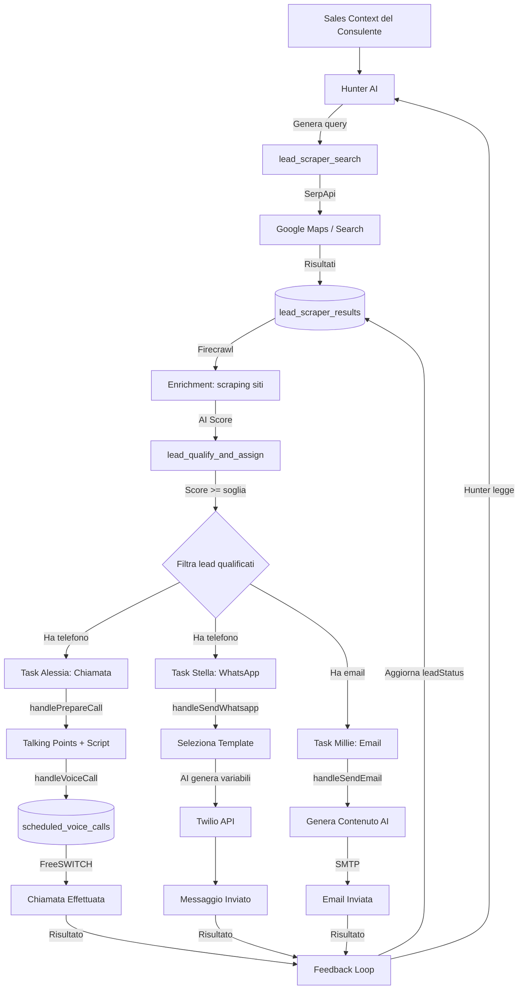
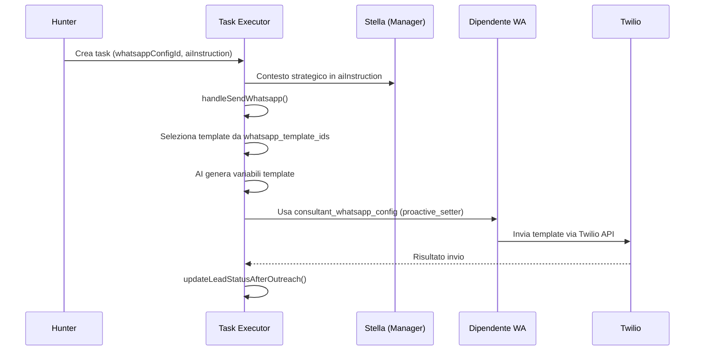
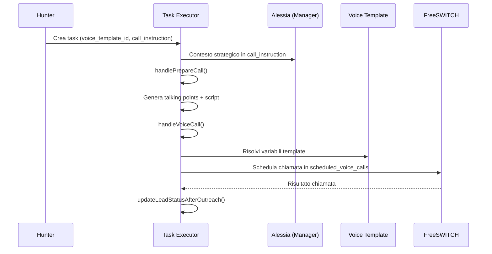
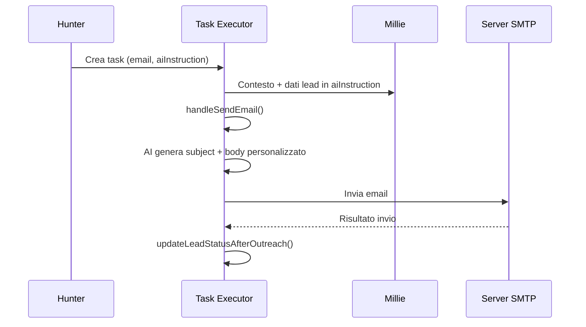

# Sistema Outreach Automatico — Hunter AI

## Panoramica

Hunter è un dipendente AI che automatizza la pipeline di acquisizione lead:
1. **Ricerca** — Trova nuovi lead su Google Maps/Search tramite SerpApi
2. **Arricchimento** — Scraping siti web via Firecrawl + AI summary/score
3. **Qualifica** — Filtra lead per score AI e crea sotto-task per canale
4. **Contatto** — Delega ad Alessia (chiamate), Stella (WhatsApp) e Millie (email)
5. **Feedback** — Legge risultati dei contatti e adatta la strategia

---

## Diagramma di Flusso Principale



## Pipeline WhatsApp (Dettaglio)



## Pipeline Voice (Dettaglio)



## Pipeline Email (Dettaglio)



---

## Architettura Tecnica

### Tabelle DB Coinvolte

| Tabella | Ruolo |
|---------|-------|
| `ai_autonomy_settings` | Config Hunter: `outreach_config` (limiti, soglia, priorità, WA config, voice template) |
| `ai_scheduled_tasks` | Task generati da Hunter e sotto-task per canale |
| `ai_activity_log` | Log di tutte le attività (ricerche, qualifiche, contatti) |
| `lead_scraper_searches` | Storico ricerche con `origin_role` (manual/hunter) |
| `lead_scraper_results` | Lead trovati con `outreach_task_id` e `lead_status` |
| `lead_scraper_activities` | Log attività per lead (contatti, cambi stato) |
| `lead_scraper_sales_context` | Sales Context del consulente (servizi, target, value proposition) |
| `consultant_whatsapp_config` | Config dipendenti WA (proactive_setter per outreach) |
| `scheduled_voice_calls` | Chiamate schedulate per FreeSWITCH |

### File Principali

| File | Responsabilità |
|------|----------------|
| `server/cron/ai-autonomous-roles.ts` | Definizione ruolo Hunter, `fetchHunterData`, `buildPrompt` |
| `server/ai/ai-task-executor.ts` | Step executor: `handleLeadScraperSearch`, `handleLeadQualifyAndAssign`, feedback loop |
| `server/ai/autonomous-decision-engine.ts` | Genera execution plan 2-step per Hunter |
| `server/services/outreach-templates.ts` | Genera istruzioni per ogni canale (call, WA, email) |
| `server/services/outreach-rate-limiter.ts` | Rate limiting e cooldown anti-spam |
| `server/services/lead-scraper-service.ts` | SerpApi + Firecrawl (ricerca e enrichment) |
| `client/src/components/autonomy/SettingsTab.tsx` | UI config outreach (canali tab) |
| `client/src/components/autonomy/constants.ts` | Profilo Hunter, capabilities, colori |
| `client/src/pages/consultant-lead-scraper.tsx` | Dashboard outreach, badge Hunter |

### Flusso Dati

```
Hunter ciclo → fetchHunterData() → Sales Context + pipeline stats + feedback
                                  ↓
                          buildPrompt() → Gemini genera task
                                  ↓
                      ai_scheduled_tasks (tipo: lead_scraper_search)
                                  ↓
              autonomous-decision-engine → Piano 2 step automatico
                                  ↓
    Step 1: handleLeadScraperSearch → SerpApi → lead_scraper_results → Firecrawl enrichment
                                  ↓
    Step 2: handleLeadQualifyAndAssign → AI score → filtra → sotto-task per canale
                                  ↓
              Sotto-task voice/wa/email → Task Executor esistente
                                  ↓
              updateLeadStatusAfterOutreach → leadStatus aggiornato
                                  ↓
              Hunter ciclo successivo → legge feedback → adatta strategia
```

---

## Rate Limiting

| Canale | Default | Range |
|--------|---------|-------|
| Ricerche Hunter/giorno | 5 | 1-10 |
| Chiamate Alessia/giorno | 10 | 1-20 |
| WhatsApp Stella/giorno | 15 | 1-30 |
| Email Millie/giorno | 20 | 1-50 |
| Cooldown stesso lead | 48h | 12-168h |
| Score AI minimo | 60 | 30-90 |

Tutti configurabili via UI nella tab Canali → "Outreach Automatico (Hunter)".

---

## Guida Test Step-by-Step

### Prerequisiti

1. **Sales Context** — Vai su Lead Scraper → tab "Sales Agent" e configura:
   - Servizi offerti
   - Pubblico target
   - Value proposition
   - Area geografica

2. **Dipendente WhatsApp** — Vai su WhatsApp → configura un dipendente di tipo `proactive_setter`:
   - Account Twilio attivo
   - Numero verificato
   - Template pre-approvati disponibili

3. **Template Voce** — Vai su Voice Calls → Configurazione:
   - Almeno un template outbound configurato (`lead-qualification`, `appointment-setter`, o `sales-orbitale`)

### Configurazione Outreach

4. **Vai su AI Autonomy → tab Canali**:
   - Attiva la sezione "Outreach Automatico (Hunter)"
   - Imposta i limiti giornalieri per canale
   - Seleziona il dipendente WhatsApp per outreach
   - Seleziona il template voce (o lascia "Automatico")
   - Imposta soglia score AI e cooldown
   - Riordina la priorità dei canali
   - Seleziona i template WhatsApp approvati

5. **Vai su AI Autonomy → tab Dipendenti**:
   - Attiva Hunter (toggle ON)
   - Imposta livello di autonomia
   - Configura frequenza e orari di lavoro

### Verifica

6. **Ricerche automatiche**: Vai su Lead Scraper → Storico. Le ricerche di Hunter hanno il badge teal "Hunter"

7. **Qualifica lead**: Vai su Lead Scraper → CRM. I lead qualificati da Hunter hanno il badge "Auto"

8. **Task creati**:
   - Task voce → visibili nel Calendario AI Voice Calls
   - Task WhatsApp → visibili nel calendario WhatsApp
   - Task email → visibili nella Activity tab di AI Autonomy

9. **Invio WhatsApp**: Verifica che il dipendente WA invii il template con variabili personalizzate

10. **Chiamate**: Verifica che le chiamate vengano schedulate con talking points e script

11. **Feedback loop**: Dopo i contatti, verifica che:
    - `leadStatus` si aggiorna (contattato, in_trattativa, non_interessato)
    - Hunter nel ciclo successivo adatta la strategia

### Troubleshooting

- **Hunter non parte**: Verifica che il Sales Context sia configurato
- **Nessun task WA**: Verifica che esista un dipendente WA `proactive_setter` attivo
- **Nessun task voce**: Verifica che ci siano template outbound configurati
- **Lead non qualificati**: Abbassa la soglia score AI nella config outreach
- **Troppi contatti**: Riduci i limiti giornalieri o aumenta il cooldown

---

## Come Comunicano i Sistemi

```
Hunter → ai_scheduled_tasks → Task Executor
Task Executor → handleLeadScraperSearch → lead-scraper-service.ts → SerpApi/Firecrawl
Task Executor → handleLeadQualifyAndAssign → genera sotto-task per ogni canale
Sotto-task WhatsApp → handleSendWhatsapp → consultant_whatsapp_config (proactive_setter) → template + variabili AI → Twilio
Sotto-task Voice → handlePrepareCall → talking points → handleVoiceCall → scheduled_voice_calls → template voce → FreeSWITCH
Sotto-task Email → handleSendEmail → contenuto AI → SMTP
Completamento → updateLeadStatusAfterOutreach → aggiorna leadScraperResults.leadStatus → leadScraperActivities
Hunter ciclo successivo → fetchHunterData → legge feedback (conversion rates, recent activities) → adatta strategia
```
